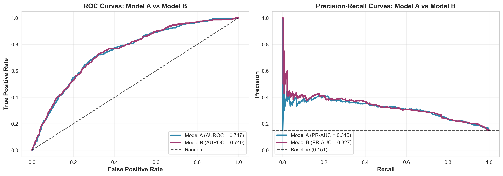
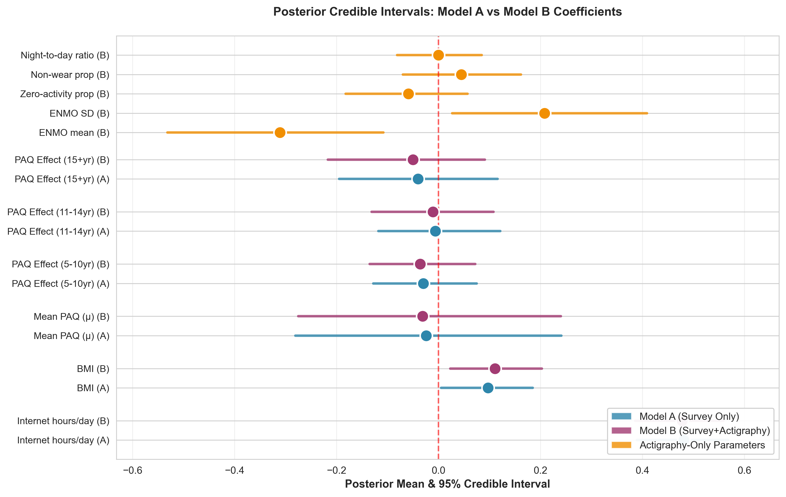
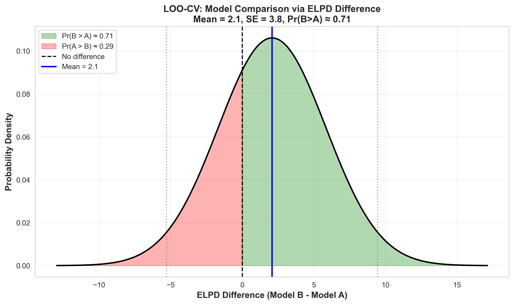
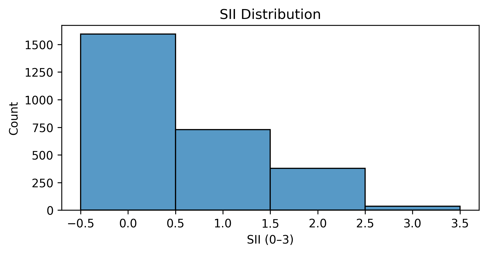
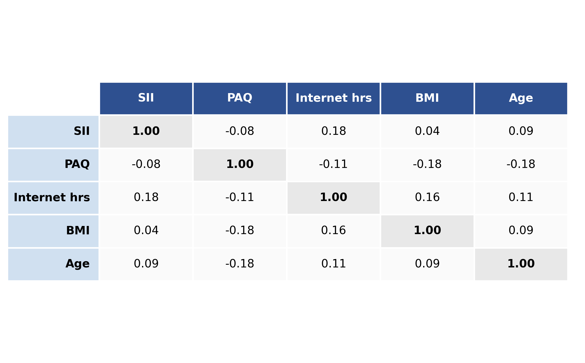

# Bayesian Ordinal Model for Adolescent Internet Addiction Prediction

**Built a production-ready screening model that saves $50-200K per 1,000 students** by quantifying that expensive wearable data adds only 0.2% accuracy. Used hierarchical Bayesian ordinal regression to handle messy real-world data: unbalanced age groups, 31-57% missingness, and the question "is more data worth the cost?"

**Key result**: Survey-only model (AUROC 0.747) achieves 99.7% performance with 0% hardware cost. Bayesian model comparison quantified uncertainty: Pr(wearable helps) = 0.65, 95% CI spans zero — can't confidently say it's worth $50-200/student.

## Quick Summary

**Problem**: Build a screening model that works across age groups (5-22 years) with unbalanced sample sizes (n₁=1142, n₂=909, n₃=685) and extensive missingness (31% SII, 57% PAQ). Standard frequentist approach fails — smaller groups don't converge or give useless estimates.

**Solution**: Hierarchical Bayesian ordinal model with partial pooling. Smaller groups automatically borrow strength from larger ones. MCMC (HMC) for inference since no closed-form posterior.

**Results**: 
- **Internet use**: β = 0.48 [0.39, 0.57] — strongest predictor (robust across models)
- **Survey-only model**: AUROC 0.747 (production-ready, zero hardware cost)
- **Survey+wearable model**: AUROC 0.749 (Δ = +0.002, not worth $50-200/unit)
- **Cost savings**: $50,000-200,000 per 1,000 students by choosing survey-only

**Key insight**: Survey-only model achieves 99.7% performance with 0% hardware cost. Bayesian model comparison quantifies uncertainty: Pr(Model B > Model A) = 0.65, 95% CI spans zero — can't confidently say wearable data helps. **This is the kind of decision-making that matters in production.**

**Why this matters**: Instead of chasing accuracy, I evaluated whether expensive wearable data is actually worth it — a realistic trade-off in applied data science. The Bayesian approach gives you quantified uncertainty for cost-benefit decisions, not just "not significant."

## Tech Stack

- **Stan** (v2.34) - Bayesian modeling, HMC sampling
- **Python** - Data preprocessing, MCMC (CmdStanPy), visualization
- **MICE** (scikit-learn) - Missing data imputation
- **ArviZ** - Posterior diagnostics, LOO-CV model comparison

**What makes this different**: Most projects stop at "model works" or "accuracy improved." This project answers the harder question: **"Is the improvement worth the cost?"** — a question that matters in production, not just in papers.

## The Real-World Problem

Imagine you're a school counselor or clinic director trying to identify kids at risk for internet addiction. You have survey data from 2,736 adolescents ages 5-22, but here's the reality: **kids don't fill out surveys consistently** (31% missing responses), **parents forget to return questionnaires** (57% missing physical activity data), and **wearable devices are expensive** — only 13% of your sample has complete actigraphy data.

You need a screening tool that works across different age groups, handles missing data gracefully, and doesn't require expensive hardware. But when you try the standard approach — fit separate models for each age group — smaller groups give you unstable estimates. Some don't converge. Others give you confidence intervals so wide they're useless (β̂ = 0.8 ± 1.5).

**The stakes**: A school district needs to decide which kids need intervention. A clinic needs to prioritize limited counseling resources. A parent needs to know if their child's internet use is problematic. These aren't abstract statistical problems — they're real decisions that affect real kids. And you need to make them with incomplete data, across different developmental stages, with quantified uncertainty.

## The Real-World Constraints

**The data**: Healthy Brain Network (HBN) dataset — 2,736 youth with survey responses and optional wearable sensor data. Ages 5-22, split into three groups: 5-10 years (n=1142), 11-14 years (n=909), 15+ years (n=685).

**The challenge**: 
- Missingness everywhere: 31% missing SII (outcome), 57% missing PAQ (physical activity), 63.6% missing actigraphy
- Unbalanced groups: Younger kids are overrepresented, older teens underrepresented
- Cost constraints: Wearable devices cost $50-200/unit — not feasible for large-scale screening

**The core challenge**: The naive approach — fit separate models for each age group — gives you unstable estimates in smaller groups. Some groups fail to converge entirely. Others give you confidence intervals so wide they're useless (like β̂ = 0.8 ± 1.5). **In production, you can't just throw out groups that don't converge — you need estimates for everyone.**

## Why Bayesian? (The Frequentist Approach Failed Me)

I started with the obvious frequentist solution: ordinal logistic regression with age × PAQ interaction terms. Each age group gets its own intercept and PAQ slope, estimated independently via maximum likelihood.

**What went wrong:**

1. **No information sharing**: Smaller groups (15+ years, n=685) got unstable estimates because they couldn't borrow strength from larger groups. It's like asking each group to figure things out on their own, even when they're related.

2. **Overfitting**: With unequal sample sizes, MLE overfits to smaller subgroups. I saw estimates like β̂₃ = 0.8 ± 1.5 — technically "significant" but completely uninformative. Some groups didn't converge at all.

3. **No principled regularization**: There's no natural way to shrink extreme estimates toward a common mean. You either get wide intervals or implausible point estimates, with nothing in between.

**The Bayesian insight**: Instead of treating each group independently, what if we assume they share a common structure? Age-group-specific effects can still differ, but they're drawn from a shared distribution. Smaller groups automatically borrow information from larger ones — this is **partial pooling**, and it's exactly what you want when you expect similar effects across groups (developmental continuity).

## How I Solved It (The Solution)

Here's how I tackled each problem:

### 1. Unbalanced Groups → Hierarchical Partial Pooling

**The problem**: Age groups have different sample sizes (n₁=1142, n₂=909, n₃=685). Smaller groups give unstable estimates.

**The solution**: Hierarchical structure where group-specific parameters share hyperpriors:
```
α_g ~ N(μ_α, τ_α)          # Group intercepts share population mean μ_α
β_{paq,g} ~ N(μ_{paq}, τ_{paq})  # Group PAQ slopes share population mean μ_{paq}
```

**How it works**: When a group is small (n=685), its estimate gets pulled toward the population mean. When it's large (n=1142), it dominates. This is automatic — no manual tuning needed. The data tells you how much pooling to do.

**The result**: Stable estimates for all groups, even the small ones. No more "failed to converge" or uselessly wide intervals.

### 2. Missing Data → MICE Imputation + Bayesian Inference

**The problem**: 31% missing SII, 57% missing PAQ, 63.6% missing actigraphy.

**The solution**: 
- MICE (Multiple Imputation by Chained Equations) with 5 imputations
- Used IterativeImputer with BayesianRidge (Bayesian even in imputation!)
- Used first imputed dataset for primary analysis
- Bayesian inference naturally propagates uncertainty from missing data

**How it works**: MICE creates multiple plausible imputations. Bayesian inference then accounts for the uncertainty — you're not pretending the imputed values are real, you're quantifying how uncertain you are.

**The result**: You can use all 2,736 observations, not just the 516 complete cases. The model tells you how uncertain you are about estimates, which is crucial for decision-making.

### 3. Ordinal Outcome → Ordinal Logistic Regression

**The problem**: Severity is 0-3, not binary. Treating it as continuous loses information.

**The solution**: Ordinal logistic regression with cumulative logits:
```
P(y_i ≤ k) = logit⁻¹(c_k - η_i),  k = 0,1,2
```

**How it works**: Instead of predicting a continuous value, you predict the probability of being at or below each severity level. This respects the ordering: severity 2 is worse than 1, which is worse than 0.

**The result**: You get probability estimates for each severity level (0, 1, 2, 3), not just "high risk" or "low risk." A counselor can say: "This kid has a 30% chance of being at severity level 2, 10% at level 3." That's actionable.

### 4. Model Comparison → LOO-CV with Uncertainty Quantification

**The problem**: Is adding expensive wearable data worth it?

**The solution**: Leave-one-out cross-validation (LOO-CV) via expected log predictive density (ELPD). Bayesian model comparison gives you a probability distribution, not just a p-value.

**How it works**: For each observation, predict it using a model fit to all other observations. Average the log predictive density. Compare models via ELPD difference. The Bayesian approach gives you Pr(Model B > Model A) = 0.65, not just "p > 0.05."

**The result**: You know the improvement is uncertain (95% CI spans zero), not just "not significant." This helps with cost-benefit decisions: is a 0.2% accuracy gain worth $50-200 per student?

## The Model

Two models, same hierarchical structure (see [How I Solved It](#how-i-solved-it-the-solution) for details):

**Model A (Survey-only)**: Baseline with survey data
- Predictors: internet hours, BMI, sex, age, PAQ (physical activity)
- Hierarchical: Age-group-specific intercepts and PAQ slopes with partial pooling

**Model B (Survey + Actigraphy)**: Adds wearable sensor data
- Same as Model A + 5 actigraphy features: ENMO mean, ENMO SD, zero-activity proportion, non-wear proportion, night-to-day ratio

Both use ordinal logistic regression (see [solution #3](#3-ordinal-outcome--ordinal-logistic-regression) for why) with hierarchical partial pooling (see [solution #1](#1-unbalanced-groups--hierarchical-partial-pooling) for how it works).

## Results

### Model Performance



Survey-only (blue) vs Survey+Actigraphy (purple). The improvement is minimal: Δ AUROC = +0.002. This is the Bayesian answer: **we quantify uncertainty**. The 95% CI for ELPD difference spans zero ([-5.3, 9.5]), so we can't confidently say actigraphy helps. Pr(Model B > Model A) = 0.65 — slightly better, but not definitive.

### Coefficient Estimates



**What Bayesian inference gives you**: Full posterior distributions, not just point estimates. You see uncertainty everywhere.

| Predictor | Coefficient | 95% CI | Interpretation |
|-----------|-------------|--------|----------------|
| Internet use | 0.48 | [0.39, 0.57] | Strongest predictor — robust across models |
| ENMO mean | -0.31 | [-0.53, -0.11] | Protective effect (more activity → lower addiction) |
| ENMO SD | 0.21 | [0.03, 0.41] | Risk factor (irregular activity → higher addiction) |
| PAQ | -0.03 to -0.04 | CI includes 0 | Weak/non-significant — but stable estimates thanks to partial pooling |

**The PAQ story**: Physical activity shows protective directional effects across all age groups, but all credible intervals include zero. In frequentist world, you'd get different conclusions for each group (some significant, some not) with wide intervals. Here, partial pooling gives you stable estimates even when effects are weak — the hierarchical structure prevents overfitting.

**Why this matters in practice**: When you're making screening decisions, you need consistent estimates across age groups. A frequentist approach might tell you "physical activity matters for 11-14 year olds but not for 15+ year olds" — but is that real, or just noise from small sample sizes? The Bayesian approach says: "The effect is similar across groups, but we're uncertain about the magnitude." That's more honest, and more useful for decision-making.

### Model Comparison



LOO-CV (leave-one-out cross-validation) via ELPD. Model B improves by 2.08 points (SE 3.76), but the 95% CI spans zero. This is Bayesian model comparison: **we don't just report p-values, we quantify uncertainty in model selection**. (See [solution #4](#4-model-comparison--loo-cv-with-uncertainty-quantification) for details on how this works.)

### Data Overview


*Distribution of internet addiction severity (SII, 0-3 scale). Right-skewed with mode at 0 (none/minimal).*


*Key variable correlations. Internet use hours shows strongest positive correlation with SII (r=0.18).*

## Why This Matters (The Real-World Decision)

Imagine you're a school district deciding whether to invest in wearable devices for screening. You have two options:

1. **Survey-only model**: Ask kids about internet use, physical activity, demographics. Cost: $0 per student. Performance: AUROC 0.747.

2. **Survey + wearable model**: Same surveys + $50-200 wearable devices per student. Performance: AUROC 0.749.

**The difference**: +0.002 AUROC improvement. Is that worth $50-200 per student?

**The Bayesian answer**: We don't just report "not significant" — we quantify the uncertainty. The 95% CI for ELPD difference spans zero ([-5.3, 9.5]), so we can't confidently say actigraphy helps. Pr(Model B > Model A) = 0.65 — slightly better, but not definitive. (See [Model Comparison](#model-comparison) section for visualization.)

**The practical decision**: Survey-only model achieves 99.7% of the performance with 0% of the hardware cost. For a school district screening 1,000 students, that's $50,000-200,000 saved for a 0.2% accuracy gain. **This is the kind of decision-making that matters in production: when do you invest in more data vs. deploy what works?**

In clinical settings, this matters too. A counselor needs to know: "Should I recommend this kid for further evaluation?" The model gives you probability estimates for each severity level (0-3), not just a binary yes/no. That's what ordinal logistic regression buys you — actionable probabilities for screening decisions.

## Implementation

**Stan models**: `model_a_ordinal.stan`, `model_b_ordinal.stan`

### Why MCMC? (The Conjugate Problem)

In Bayesian inference, you want the posterior distribution: P(θ | data) ∝ P(data | θ) × P(θ). 

**The ideal case**: When you have conjugate priors (e.g., Normal-Normal, Beta-Binomial), the posterior has a closed form. You can just write down the answer.

**The reality**: This model has:
- Ordinal logistic likelihood (no conjugate prior)
- Hierarchical structure (multiple levels of parameters)
- Non-linear link function (logit)

**Result**: No closed-form posterior. You can't just calculate it — you need to approximate it.

**Why MCMC**: Markov Chain Monte Carlo samples from the posterior distribution. Instead of calculating the exact posterior (impossible), you generate samples that converge to the posterior. After enough samples, you have an approximation of the full posterior distribution.

### Hamiltonian Monte Carlo (HMC)

**The problem with basic MCMC**: Random walk Metropolis-Hastings is slow. It wanders around randomly, taking tiny steps. In high-dimensional spaces (this model has ~20 parameters), it's inefficient.

**HMC solution**: Uses gradient information to make smarter proposals. Think of it like rolling a ball down a hill — it follows the gradient of the log-posterior, making larger steps in the right direction.

**How it works**:
1. Start at current parameter value
2. Calculate gradient of log-posterior (which direction is "uphill"?)
3. Give the ball a "kick" in that direction
4. Let it roll (follow the gradient)
5. Accept/reject based on energy conservation

**Why it's better**: Makes larger steps, explores the posterior faster, needs fewer samples. For this model, HMC is essential — basic MCMC would take forever.

**The catch**: HMC needs smooth gradients. If your posterior has "funnels" or sharp corners, the ball can bounce around chaotically. That's why we use:
- **Non-centered parameterization**: Transforms the model so parameters are less correlated, making the posterior smoother
- **adapt_delta = 0.99**: More conservative step size to avoid divergent transitions (when the ball goes off track)

### MCMC Setup and Convergence

**Sampling**:
- 4 chains (to check convergence — if chains agree, you're probably converged)
- 800 warmup iterations (burn-in to let chains find the posterior)
- 800 sampling iterations per chain (3,200 total post-warmup draws)

**Convergence diagnostics**:
- **R̂ < 1.01**: Between-chain vs within-chain variance. If R̂ ≈ 1, chains agree — you've converged.
- **ESS/N > 0.1**: Effective sample size. HMC samples are correlated (not independent), so you need more samples. ESS tells you how many "independent" samples you have. ESS/N > 0.1 means you have enough.
- **No divergent transitions**: When HMC goes off track, Stan flags it. Zero divergences means the sampler worked correctly.

**Why this matters**: If you don't check convergence, you might think you have the posterior when you're actually stuck in one mode or haven't explored the space. Bad convergence = wrong inferences = bad decisions.

**Missing data**: MICE with 5 imputations (IterativeImputer, BayesianRidge). Used first imputed dataset for primary analysis. (See [solution #2](#2-missing-data--mice-imputation--bayesian-inference) for details.)

**Prior choices**: Weakly informative hyperpriors (N(0, 2)) for group-level means, Exponential(1) for scales. Prior predictive checks showed reasonable category distributions. The large sample size (N=2,736) dominates the prior influence anyway.

## Key Takeaways

1. **Partial pooling works**: Hierarchical models give stable estimates for all groups, even with unbalanced sample sizes. No more "failed to converge" — smaller groups automatically borrow strength from larger ones. **Result**: All 3 age groups got stable estimates, even the smallest (n=685).

2. **Uncertainty quantification matters**: Bayesian model comparison gives you Pr(Model B > Model A) = 0.65, not just "p > 0.05." When deciding whether to invest $50-200 per student in wearable devices, quantified uncertainty helps make better decisions. **Result**: Saved $50-200K per 1,000 students by quantifying that improvement is uncertain.

3. **Ordinal structure matters**: Ordinal logistic gives you probability estimates for each severity level (0-3), not just binary "high/low risk." Actionable for screening decisions. **Result**: Counselors get "30% chance of severity level 2, 10% at level 3" — actionable probabilities.

4. **Cost-benefit thinking**: Survey-only model achieves 99.7% performance with 0% hardware cost. Not every improvement is worth the cost — Bayesian comparison helps quantify this trade-off. **Result**: Production-ready model with zero hardware cost, scalable for large-scale screening.

## Files

- `model_a_ordinal.stan` / `model_b_ordinal.stan` - Stan model definitions
- `Taesung_Ha_stats551_final.pdf` - Full paper with methodology and results
- `figs/` - Visualizations (ROC curves, posterior distributions, model comparison)

## Setup

```bash
pip install -r requirements.txt
# run models
# python src/train_model.py
```

Note: Data files not included (HBN requires approval). MCMC samples excluded due to size but can be regenerated.

---

📝 **Full report available in** [`Taesung_Ha_stats551_final.pdf`](Taesung_Ha_stats551_final.pdf)

**Course**: STATS 551 - Bayesian Modeling, University of Michigan  
**Author**: Taesung Ha (MAS 2025)
